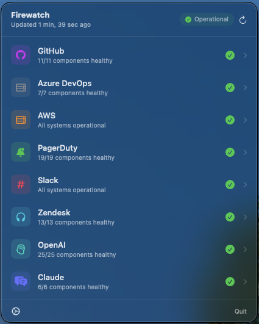
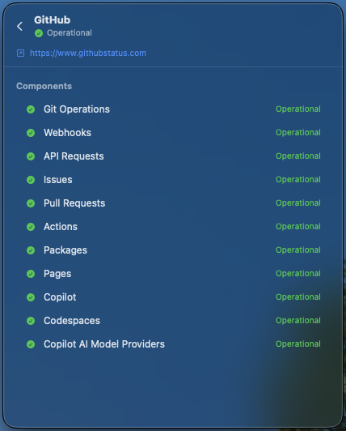
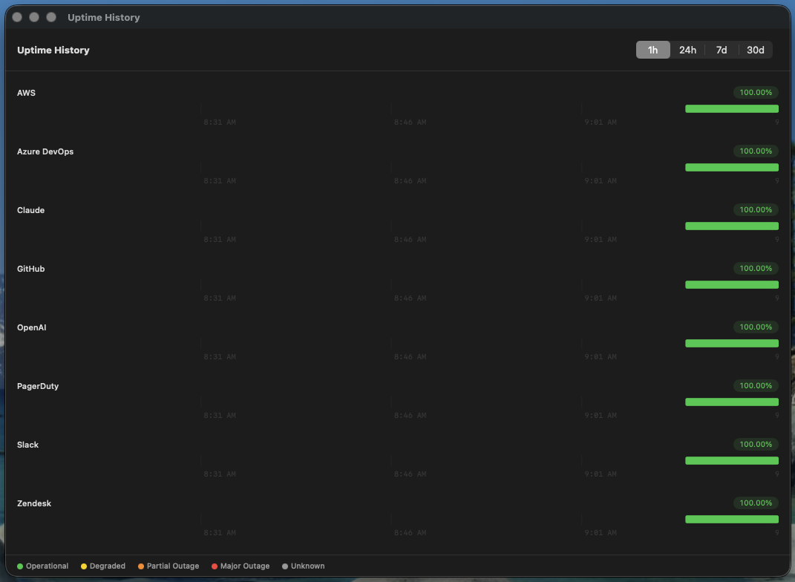
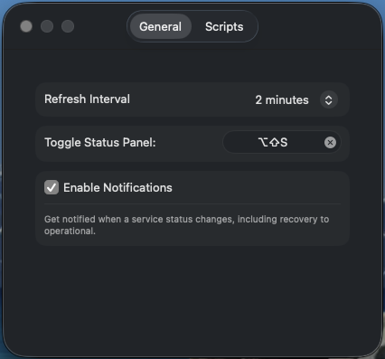
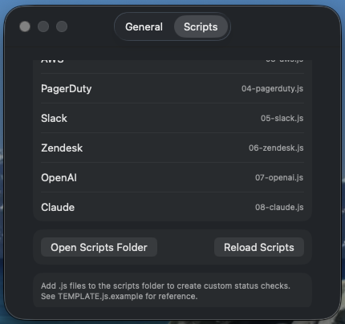

# Firewatch

A macOS menu bar app that monitors the health of key infrastructure services at a glance.

<p align="center">
  
</p>

## Features

- **Menu bar status icon** — changes color and shape to reflect overall service health (green/yellow/orange/red)
- **Status dashboard** — floating panel shows all monitored services with component-level detail
- **Service drill-down** — click any service to see components, active incidents, and recent event history
- **Global keyboard shortcut** — configurable hotkey to toggle the dashboard (default: ⇧⌥S)
- **Background polling** — refreshes service status on a configurable interval (default: 2 minutes)
- **macOS notifications** — opt-in alerts when a service degrades, integrated with the native notification system
- **Uptime history** — opt-in logging of service health at each poll interval, with a graphical timeline showing historical uptime per service
- **Custom status checks** — write JavaScript scripts to monitor any service, using a built-in API
- **Dark mode support** — adapts to system appearance

<p align="center">
  
  &nbsp;&nbsp;
  
</p>

<p align="center">
  
</p>

## Default Services

| Service | Source |
|---------|--------|
| GitHub | [githubstatus.com](https://www.githubstatus.com) |
| Azure DevOps | [status.dev.azure.com](https://status.dev.azure.com) |
| AWS | [health.aws.amazon.com](https://health.aws.amazon.com/health/status) |
| PagerDuty | [status.pagerduty.com](https://status.pagerduty.com) |
| Slack | [status.slack.com](https://status.slack.com) |
| Zendesk | [status.zendesk.com](https://status.zendesk.com) |
| OpenAI | [status.openai.com](https://status.openai.com) |
| Claude | [status.claude.com](https://status.claude.com) |

## Requirements

- macOS 14.0 (Sonoma) or later
- Xcode 16+ to build

## Building

Building from source is the preferred method.

```bash
# Install XcodeGen if needed
brew install xcodegen

# Generate the Xcode project
cd Firewatch
xcodegen generate

# Build
xcodebuild -project Firewatch.xcodeproj -scheme Firewatch -configuration Release build
```

Or open `Firewatch.xcodeproj` in Xcode and run.

### Using the Pre-Built Binary

A pre-built binary is provided for convenience. Since it is not signed with an Apple Developer certificate, macOS will quarantine it on download. To remove the quarantine flag:

```bash
sudo xattr -r -d com.apple.quarantine /path/to/Firewatch.app
```

## Settings

Access settings via the gear icon in the dashboard panel.

- **Refresh Interval** — 30 seconds to 10 minutes
- **Keyboard Shortcut** — customizable global hotkey
- **Notifications** — enable/disable macOS notification alerts for status changes
- **Uptime Logging** — enable/disable recording of service health for historical graphs
- **Scripts** — view loaded check scripts, open the scripts folder, or reload after edits

<p align="center">
  
  &nbsp;&nbsp;
  
</p>

## Custom Status Checks

Firewatch runs JavaScript check scripts using Apple's built-in JavaScriptCore engine — no external runtime required. Scripts live in:

```
~/Library/Application Support/Firewatch/checks/
```

On first launch, Firewatch copies the default check scripts into this directory. You can edit existing scripts or add new ones.

### How It Works

Each `.js` file in the checks directory is a status check. The app:

1. **Reads metadata** from comment headers (`FIREWATCH_NAME`, `FIREWATCH_URL`) without executing the script
2. **Runs the script** in a sandboxed JavaScript context with injected helper functions
3. **Parses the output** from the `output()` call and displays it in the dashboard

Scripts are sorted alphabetically by filename. Use numeric prefixes to control order (e.g., `01-github.js`, `02-aws.js`).

### Available Functions

| Function | Description |
|----------|-------------|
| `fetch(url)` | HTTP GET → parsed JSON object |
| `fetch(url, {encoding: "utf-16"})` | HTTP GET with custom response encoding |
| `fetchResponse(url)` | HTTP GET → `{ status: <http_code>, body: <json_or_null> }` |
| `fetchText(url)` | HTTP GET → raw response string |
| `fetchAll([url1, url2, ...])` | Concurrent HTTP GET → array of parsed JSON |
| `output(obj)` | Set the script's result (required, call exactly once) |
| `stripHtml(text)` | Remove HTML tags and decode entities |
| `log(message)` | Debug logging (visible in Console.app) |
| `statuspageCheck(url)` | One-liner for any Statuspage.io service |
| `statuspageCheck(url, {showcaseFilter: false})` | Same, but includes all components |

### Status Values

Use these strings for the `status`, component `status`, and incident `impact` fields:

| Value | Meaning |
|-------|---------|
| `operational` | All systems normal |
| `degraded` | Degraded performance |
| `partial_outage` | Partial outage |
| `major_outage` | Major outage |
| `unknown` | Unable to determine |

### Output Schema

Only `status` is required. Everything else is optional:

```json
{
  "status": "operational",
  "components": [
    { "name": "API", "status": "operational", "description": "Optional detail" }
  ],
  "incidents": [
    {
      "title": "Elevated error rates",
      "status": "Investigating",
      "impact": "minor",
      "created_at": "2025-01-15T10:00:00Z",
      "is_active": true,
      "updates": [
        { "body": "Looking into it.", "status": "Investigating", "created_at": "2025-01-15T10:05:00Z" }
      ]
    }
  ]
}
```

### Example: Simple Health Check

The simplest possible check — just test if a URL responds:

```javascript
// FIREWATCH_NAME = "My API"
// FIREWATCH_URL = "https://api.example.com"

try {
    fetch("https://api.example.com/health");
    output({ status: "operational" });
} catch (e) {
    output({ status: "major_outage" });
}
```

### Example: HTTP Status Code Check

Use `fetchResponse()` to branch on HTTP status codes:

```javascript
// FIREWATCH_NAME = "My API"
// FIREWATCH_URL = "https://api.example.com"

var res = fetchResponse("https://api.example.com/health");

if (res.status === 503) {
    output({ status: "major_outage" });
} else if (res.status === 429 || res.status >= 500) {
    output({ status: "degraded" });
} else if (res.status === 200) {
    output({ status: "operational" });
} else {
    output({ status: "unknown" });
}
```

### Example: Statuspage.io Service

For services powered by Statuspage.io (like GitHub, Atlassian, etc.), use the built-in helper:

```javascript
// FIREWATCH_NAME = "Atlassian"
// FIREWATCH_URL = "https://status.atlassian.com"

statuspageCheck("https://status.atlassian.com/api/v2/summary.json");
```

### Example: Custom API with Components

Parse a custom API response and map it to components:

```javascript
// FIREWATCH_NAME = "Internal Platform"
// FIREWATCH_URL = "https://status.internal.example.com"

var data = fetch("https://status.internal.example.com/api/health");

var components = (data.services || []).map(function(svc) {
    return {
        name: svc.name,
        status: svc.healthy ? "operational" : "major_outage",
        description: svc.message || null
    };
});

var worst = "operational";
components.forEach(function(c) {
    if (c.status === "major_outage") worst = "major_outage";
    else if (c.status === "degraded" && worst === "operational") worst = "degraded";
});

output({ status: worst, components: components });
```

### Example: Multiple URLs with Logic

Fetch from multiple endpoints concurrently, cross-reference the data, and build a detailed result:

```javascript
// FIREWATCH_NAME = "My Platform"
// FIREWATCH_URL = "https://status.example.com"

// Fetch status and incidents concurrently
var results = fetchAll([
    "https://status.example.com/api/services",
    "https://status.example.com/api/incidents?days=7"
]);
var services = results[0];
var incidents = results[1];

// Find active incidents and which services they affect
var activeIncidents = incidents.filter(function(inc) { return !inc.resolved_at; });
var affectedServiceIds = {};
activeIncidents.forEach(function(inc) {
    (inc.affected_services || []).forEach(function(id) {
        affectedServiceIds[id] = true;
    });
});

// Build components with status derived from incident data
var components = services.map(function(svc) {
    var status = affectedServiceIds[svc.id] ? "partial_outage" : "operational";
    return { name: svc.name, status: status, description: svc.region };
});

// Map incidents for display
var mappedIncidents = activeIncidents.map(function(inc) {
    return {
        title: inc.title,
        status: inc.status,
        impact: inc.severity === "critical" ? "major_outage" : "degraded",
        created_at: inc.created_at,
        is_active: true,
        updates: (inc.updates || []).map(function(u) {
            return { body: u.message, status: u.status, created_at: u.timestamp };
        })
    };
});

// Overall status is the worst component
var overallStatus = "operational";
components.forEach(function(c) {
    if (c.status !== "operational") overallStatus = c.status;
});

output({
    status: overallStatus,
    components: components,
    incidents: mappedIncidents
});
```

### Tips

- **Disable a check** — remove the `.js` file or rename its extension (e.g., `.js.disabled`)
- **Reorder checks** — rename files with numeric prefixes (`01-`, `02-`, etc.)
- **Debug a script** — use `log("message")` and check Console.app for output
- **Reload after edits** — go to Settings → Scripts → Reload Scripts, or restart the app
- **Script errors** — if a script throws or never calls `output()`, the service shows as "Unknown"

## Architecture

Status checks are JavaScript scripts executed via Apple's built-in [JavaScriptCore](https://developer.apple.com/documentation/javascriptcore) framework. This means:

- **Zero dependencies** — no Python, Node.js, or shell tools required
- **Sandboxed** — scripts can only access the network through the injected `fetch()` function
- **Fast** — scripts run in-process (~1ms context creation) rather than spawning subprocesses
- **Portable** — works on every macOS version that supports JavaScriptCore (all of them)

## Third-Party Libraries

- **[KeyboardShortcuts](https://github.com/sindresorhus/KeyboardShortcuts)** by Sindre Sorhus — MIT License. Used for configurable global keyboard shortcuts.

## Image Attribution

App icon: *Wildfire Watch Tower* — [StockCake](https://stockcake.com/i/wildfire-watch-tower_2538630_1477269). Free to use with attribution.

## License

This project is licensed under the MIT License. See [LICENSE](LICENSE) for details.
